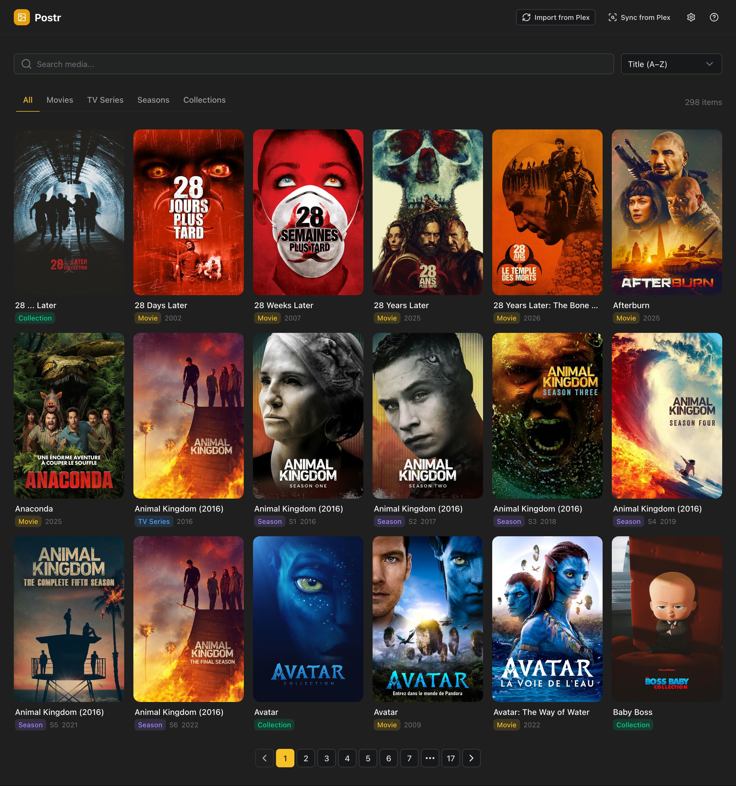
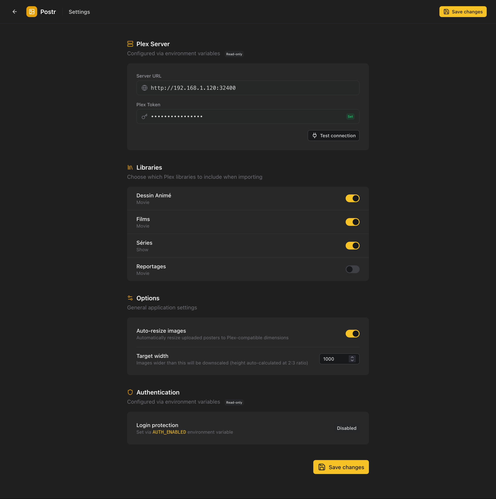

<p align="center">
  
</p>

<p align="center">
  A self-hosted web application for managing poster artwork in your Plex Media Server.
</p>

<p align="center">
  
  
  
  
</p>

---

## Overview

Postr lets you browse your Plex library and replace poster images for movies, TV series, seasons, and collections — directly from your browser. Upload a file, paste an image URL, or let Postr sync posters that have changed in Plex.

Designed for homelab deployment via Docker. Inspired by [Posteria](https://github.com/jeremehancock/Posteria).

<p align="center">
  
  
</p>

---

## Features

- **Import from Plex** — Fetch your entire library and download all posters locally. Real-time progress via SSE with a detailed recap (added, skipped, deleted).
- **Sync from Plex** — Detect posters that have changed directly in Plex and update your local copies. Skips items you have modified locally.
- **Upload posters** — Drag & drop an image file or paste a direct URL. Optional auto-resize to Plex-compatible dimensions.
- **Push to Plex** — Queue poster changes locally and push them to Plex one by one or all at once.
- **Restore from Plex** — Revert any locally modified poster back to the current Plex version.
- **Orphaned items** — Items no longer found in Plex are automatically flagged and can be cleaned up from a dedicated tab.
- **Library filtering** — Filter by type (Movies, TV Series, Seasons, Collections), sort by title, year, or recently added, and search in real time.
- **Optional authentication** — Protect the UI with a username and password when exposing it to the internet.

---

## Quick Start

### Docker Compose

```yaml
services:
  postr:
    image: ghcr.io/florentsorel/postr:latest
    container_name: postr
    ports:
      - "8720:8080"
    volumes:
      - ./data:/data
    environment:
      PLEX_URL: http://192.168.1.x:32400
      PLEX_TOKEN: your-plex-token
      DB_PATH: /data/postr.db
      DATA_PATH: /data
    restart: unless-stopped
```

Then open [http://localhost:8720](http://localhost:8720) in your browser.

> **Pinning a version** — replace `:latest` with a specific release tag (e.g. `ghcr.io/florentsorel/postr:1.2.3`) to avoid unexpected changes on container restart. Available tags are listed on the [container registry](https://github.com/florentsorel/postr/pkgs/container/postr).

---

## Environment Variables

| Variable | Required | Description |
|---|---|---|
| `PLEX_URL` | Yes | Base URL of your Plex Media Server (e.g. `http://192.168.1.x:32400`) |
| `PLEX_TOKEN` | Yes | Plex authentication token — [how to find yours](https://support.plex.tv/articles/204059436-finding-an-authentication-token-x-plex-token/) |
| `DB_PATH` | No | Path to the SQLite database file (default: `./postr.db`) |
| `DATA_PATH` | No | Path to the local poster storage directory (default: `./data`) |
| `AUTH_ENABLED` | No | Enable login protection — `true` or `false` (default: `false`) |
| `AUTH_USER` | No | Username for login (required if `AUTH_ENABLED=true`) |
| `AUTH_PASS` | No | Password for login (required if `AUTH_ENABLED=true`) |

### Finding your Plex Token

1. Sign in to your Plex account in the [Plex Web App](https://app.plex.tv)
2. Browse to any library item, click the **···** menu → **Get info** → **View XML**
3. Look in the URL and copy the `X-Plex-Token` value — e.g. `?X-Plex-Token=xxxxxxxxxxxxxxxxxxxx`

> Source: [Plex Support — Finding an authentication token](https://support.plex.tv/articles/204059436-finding-an-authentication-token-x-plex-token/)

---

## Authentication

Authentication is disabled by default, suitable for local/homelab use. To enable it:

```yaml
environment:
  AUTH_ENABLED: "true"
  AUTH_USER: admin
  AUTH_PASS: a-strong-password
```

---

## Data & Logs

Postr writes all persistent data under `DATA_PATH`:

```
data/
├── postr.db          # SQLite database
├── logs/
│   └── access.log    # HTTP access log (JSON)
└── posters/
    ├── movie/        # Movie posters
    ├── show/         # TV series posters
    ├── season/       # Season posters
    └── collection/   # Collection posters
```

Application logs (startup, import, sync, errors) are written to **stdout**.

### Log rotation

Since `access.log` lives in your mounted volume, you can rotate it with `logrotate` on the host:

```
/path/to/data/logs/access.log {
    daily
    rotate 7
    compress
    missingok
    notifempty
    copytruncate
}
```

---

## License

MIT
