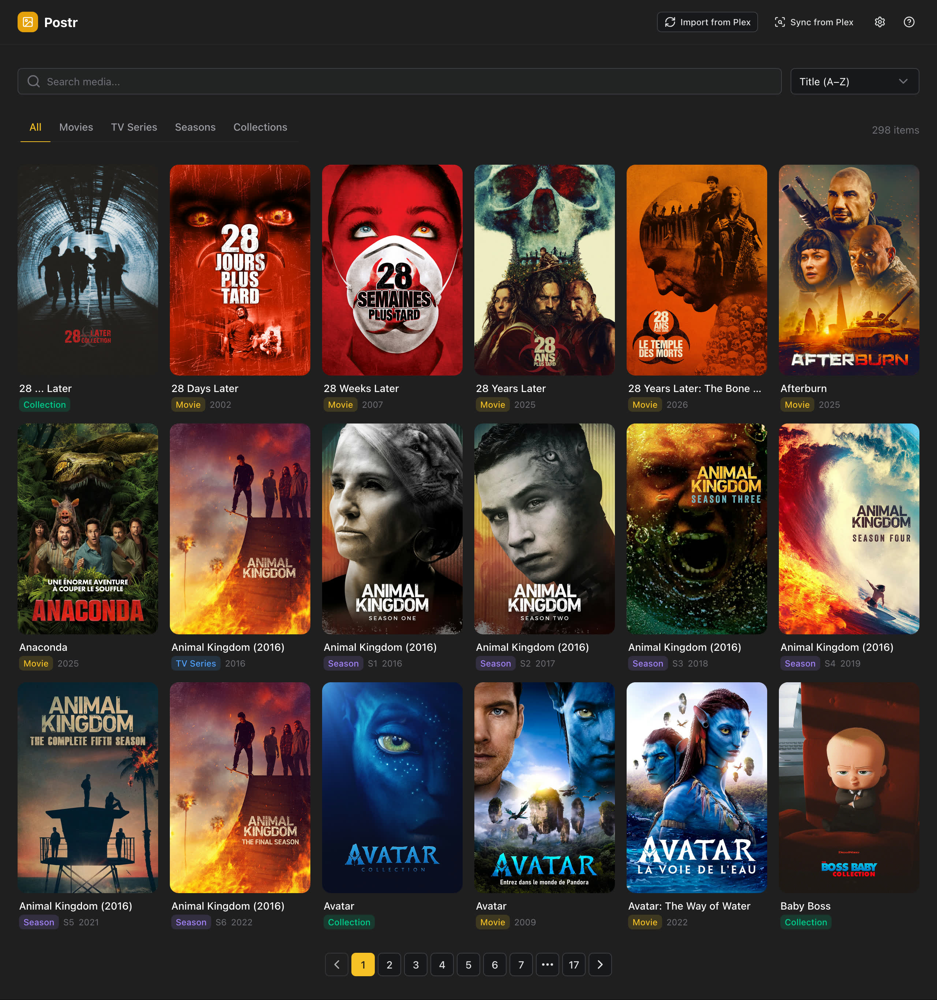
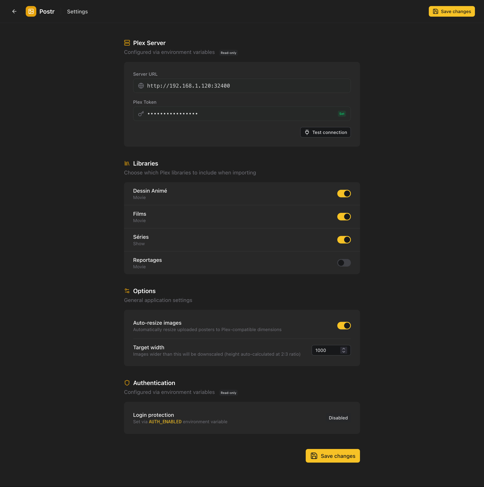

<p align="center">
  
</p>

<p align="center">
  A self-hosted web application for managing poster artwork in your Plex or Jellyfin media server.
</p>

<p align="center">
  
  
  
  
</p>

---

## Overview

Postr lets you browse your media library and replace poster images for movies, TV series, seasons, and collections — directly from your browser. Upload a file, paste an image URL, or let Postr sync posters that have changed on your server.

Postr works with **Plex** or **Jellyfin**. You pick one server via environment variables and the whole interface adapts to it.

Designed for homelab deployment via Docker. Inspired by [Posteria](https://github.com/jeremehancock/Posteria).

<p align="center">
  
  
</p>

---

## Features

- **Plex or Jellyfin** — Point Postr at either server; every label, action and error message follows the one you configured.
- **Import** — Fetch your entire library and download all posters locally. Real-time progress via SSE with a detailed recap (added, skipped, deleted).
- **Sync** — Detect posters that have changed directly on your server and update your local copies. Skips items you have modified locally.
- **Upload posters** — Drag & drop an image file or paste a direct URL. Optional auto-resize to poster-friendly dimensions.
- **Push to your server** — Queue poster changes locally and push them one by one or all at once.
- **Restore** — Revert any locally modified poster back to the version currently on your server.
- **Orphaned items** — Items no longer found on your server are automatically flagged and can be cleaned up from a dedicated tab.
- **Library filtering** — Filter by type (Movies, TV Series, Seasons, Collections), sort by title, year, or recently added, and search in real time.
- **Optional authentication** — Protect the UI with a username and password when exposing it to the internet.

---

## Quick Start

### Docker Compose

```yaml
services:
  postr:
    image: ghcr.io/florentsorel/postr:latest
    container_name: postr
    ports:
      - "8720:8080"
    volumes:
      - ./data:/data
    environment:
      PLEX_URL: http://192.168.1.x:32400
      PLEX_TOKEN: your-plex-token
      DB_PATH: /data/postr.db
      DATA_PATH: /data
    restart: unless-stopped
```

For Jellyfin, swap the two Plex variables:

```yaml
    environment:
      MEDIA_SERVER: jellyfin
      JELLYFIN_URL: http://192.168.1.x:8096
      JELLYFIN_API_KEY: your-jellyfin-api-key
      DB_PATH: /data/postr.db
      DATA_PATH: /data
```

Then open [http://localhost:8720](http://localhost:8720) in your browser.

> **Pinning a version** — replace `:latest` with a specific release tag (e.g. `ghcr.io/florentsorel/postr:1.2.3`) to avoid unexpected changes on container restart. Available tags are listed on the [container registry](https://github.com/florentsorel/postr/pkgs/container/postr).

---

## Environment Variables

| Variable | Required | Description |
|---|---|---|
| `MEDIA_SERVER` | No | Which server to use — `plex` or `jellyfin`. Defaults to `plex`, or `jellyfin` when only `JELLYFIN_URL` is set |
| `PLEX_URL` | Plex only | Base URL of your Plex Media Server (e.g. `http://192.168.1.x:32400`) |
| `PLEX_TOKEN` | Plex only | Plex authentication token — [how to find yours](https://support.plex.tv/articles/204059436-finding-an-authentication-token-x-plex-token/) |
| `JELLYFIN_URL` | Jellyfin only | Base URL of your Jellyfin server (e.g. `http://192.168.1.x:8096`) |
| `JELLYFIN_API_KEY` | Jellyfin only | Jellyfin API key — create one in **Dashboard → Advanced → API Keys** |
| `DB_PATH` | No | Path to the SQLite database file (default: `./postr.db`) |
| `DATA_PATH` | No | Path to the local poster storage directory (default: `./data`) |
| `AUTH_ENABLED` | No | Enable login protection — `true` or `false` (default: `false`) |
| `AUTH_USER` | No | Username for login (required if `AUTH_ENABLED=true`) |
| `AUTH_PASS` | No | Password for login (required if `AUTH_ENABLED=true`) |

### Finding your Plex Token

1. Sign in to your Plex account in the [Plex Web App](https://app.plex.tv)
2. Browse to any library item, click the **···** menu → **Get info** → **View XML**
3. Look in the URL and copy the `X-Plex-Token` value — e.g. `?X-Plex-Token=xxxxxxxxxxxxxxxxxxxx`

> Source: [Plex Support — Finding an authentication token](https://support.plex.tv/articles/204059436-finding-an-authentication-token-x-plex-token/)

### Finding your Jellyfin API key

1. Sign in to Jellyfin as an administrator
2. Go to **Dashboard → Advanced → API Keys**
3. Click **+**, give the key a name (e.g. `Postr`), and copy the generated value

---

## Switching servers

Postr talks to one server at a time. Every imported item is tagged with the
server it came from, so switching `MEDIA_SERVER` hides the other server's data
rather than deleting it — switch back and your previous library is still there.

Since Plex and Jellyfin use different item identifiers, a switch requires a
fresh import from the new server.

### Migrating your posters

The artwork you already collected does not have to be rebuilt by hand. If both
servers are configured — keep `PLEX_URL` / `PLEX_TOKEN` alongside your Jellyfin
settings — a **Migrate posters** section appears in Settings.

```yaml
    environment:
      MEDIA_SERVER: jellyfin
      JELLYFIN_URL: http://192.168.1.x:8096
      JELLYFIN_API_KEY: your-jellyfin-api-key
      # Kept only so posters can be carried over:
      PLEX_URL: http://192.168.1.x:32400
      PLEX_TOKEN: your-plex-token
```

Import your new library first, then run the migration. Postr recognises the same
title on both servers through the TMDB / IMDB / TVDB identifiers each of them
stores, falling back to the title when there is none — which is the only option
for collections, since no external database tracks them.

Matched posters are placed in the **queue**, not pushed. You review them and
choose when to send them, and your original posters are left untouched, so the
migration can be repeated or abandoned at no cost — a second run only picks up
what has changed. Anything that could not be matched with confidence — an
ambiguous title, no counterpart on the new server — is listed at the end rather
than guessed at.

> **Collections usually will not match.** No external database tracks them, so
> they are paired on their title alone. If your servers name them differently —
> a translation, a `- Saga` suffix — they are reported as unmatched and you will
> need to set those posters by hand. Movies, shows and seasons are unaffected:
> they match on their TMDB / IMDB / TVDB identifiers regardless of language.

---

## Authentication

Authentication is disabled by default, suitable for local/homelab use. To enable it:

```yaml
environment:
  AUTH_ENABLED: "true"
  AUTH_USER: admin
  AUTH_PASS: a-strong-password
```

---

## Data & Logs

Postr writes all persistent data under `DATA_PATH`:

```
data/
├── postr.db          # SQLite database
├── logs/
│   └── access.log    # HTTP access log (JSON)
└── posters/
    └── plex/         # One directory per media server
        ├── movie/        # Movie posters
        ├── show/         # TV series posters
        ├── season/       # Season posters
        └── collection/   # Collection posters
```

Posters are grouped by the server they came from, so artwork from two servers
never mixes. Libraries created before multi-server support stored them directly
under `posters/{type}/`; Postr relocates those into `posters/plex/` on first
start, and says so in its startup log.

Application logs (startup, import, sync, errors) are written to **stdout**.

### Log rotation

Since `access.log` lives in your mounted volume, you can rotate it with `logrotate` on the host:

```
/path/to/data/logs/access.log {
    daily
    rotate 7
    compress
    missingok
    notifempty
    copytruncate
}
```

---

## License

MIT
